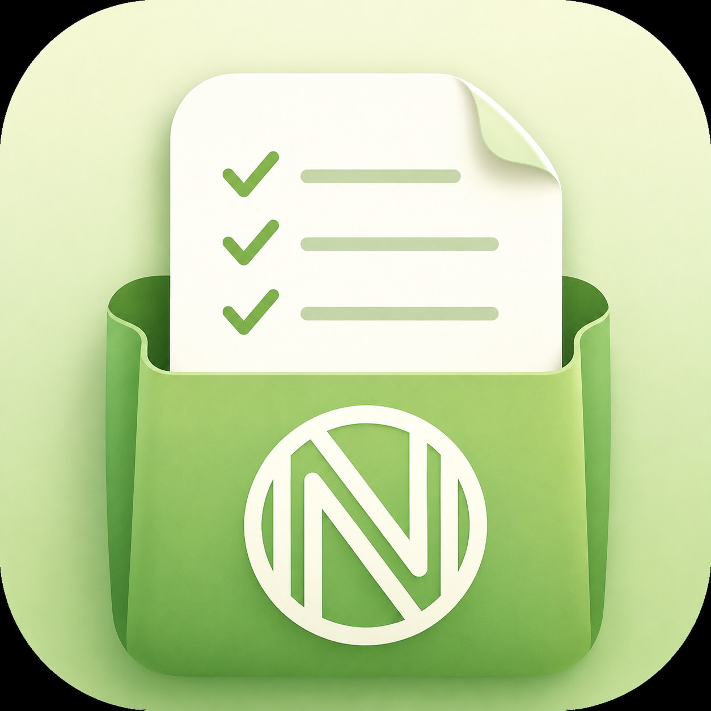

# 🛒 Nnmaki Shopping List

<p align="center">
  
</p>

<p align="center">
  Yksinkertainen ja selkeä ostoslistasovellus Android-laitteille.<br/>
  Rakennettu React Native / Expo -kirjastolla.
</p>

<p align="center">
  <a href="https://nnmaki.com/shoppinglist">
    
  </a>
</p>

---

## 📱 Lataa sovellus

Voit ladata sovelluksen APK-tiedostona suoraan osoitteesta:

**👉 [nnmaki.com/shoppinglist](https://nnmaki.com/shoppinglist)**

> Sovellus vaatii Android 6.0:n tai uudemman.

---

## ✨ Ominaisuudet

- Lisää ostoksia nopeasti listalle
- Merkitse tuotteet tehdyksi yhdellä napauksella
- Toimii ilman internet-yhteyttä
- Selkeä ja kevyt käyttöliittymä

---

## 🔧 Mikä on Expo?

[Expo](https://expo.dev) on avoimen lähdekoodin alusta React Native -sovellusten kehittämiseen. Sen avulla voi rakentaa iOS- ja Android-sovelluksia JavaScriptillä ja Reactilla ilman, että tarvitsee erikseen asentaa Xcodea tai Android Studiota kehitysvaiheessa.

Expo tarjoaa muun muassa:

- **Expo Go** – sovellus, jolla voi testata kehitysversiota suoraan puhelimella
- **EAS Build (Expo Application Services)** – pilvipalvelu, joka kääntää sovelluksen natiiviksi APK- tai IPA-tiedostoksi
- Valmiit kirjastot kameran, ilmoitusten, tiedostojärjestelmän ja muiden natiiviominaisuuksien käyttöön

Tämä projekti on buildattu EAS Buildin avulla natiiviksi Android APK -tiedostoksi.

---

## 🚀 Kehitysympäristön käynnistys

```bash
# Asenna riippuvuudet
npm install

# Käynnistä Expo kehitysserveri
npx expo start
```

Skannaa QR-koodi [Expo Go](https://expo.dev/go) -sovelluksella tai käynnistä emulaattorissa.

### APK:n buildaus EAS:lla

```bash
# Asenna EAS CLI
npm install -g eas-cli

# Kirjaudu sisään
eas login

# Buildaa APK
eas build -p android --profile preview
```

---

## 📲 Asennusohjeet – ulkoinen APK Androidille

Koska sovellus ei ole Google Play -kaupassa, asennus vaatii muutaman lisäaskeleen.

### Vaihe 1 – Poista Google Play Protect väliaikaisesti käytöstä

1. Avaa **Google Play -kauppa**
2. Napauta oikeasta yläkulmasta **profiilikuvaasi**
3. Valitse **Play Protect**
4. Napauta oikeasta yläkulmasta **rataskuvaketta ⚙**
5. Kytke **"Tarkista sovellukset Play Protectilla"** pois päältä
6. Vahvista napauttamalla **Poista käytöstä**

> ⚠️ Muista kytkeä Play Protect takaisin päälle asennuksen jälkeen!

### Vaihe 2 – Anna asennuslupa oikealle sovellukselle

Lupa täytyy myöntää **sille sovellukselle, jonka kautta asennat** – ei pelkästään yleisistä asetuksista.

- **Selaimella (esim. Chrome):** Latauksen jälkeen napauta *Asenna* → Android pyytää lupaa → valitse *Asetukset* → kytke **"Salli tästä lähteestä"** päälle Chromen kohdalta.
- **Tiedostonhallinnalla (esim. Files by Google):** Napauta APK-tiedostoa → myönnä lupa **tiedostonhallintasovellukselle** erikseen.

### Vaihe 3 – Lataa ja asenna

1. Siirry osoitteeseen **[nnmaki.com/shoppinglist](https://nnmaki.com/shoppinglist)**
2. Napauta *Lataa APK Androidille* -painiketta
3. Avaa ladattu tiedosto ja seuraa asennusvelhon ohjeita
4. Sovellus ilmestyy kotiruudulle tai sovellusvalikkoosi

---

## 🛠️ Teknologiat

| Teknologia | Kuvaus |
|---|---|
| React Native | Natiivisovelluksen pohja |
| Expo SDK | Kehitysalusta ja työkalut |
| EAS Build | APK:n kääntäminen pilvessä |

---

## 📄 Lisenssi

MIT
